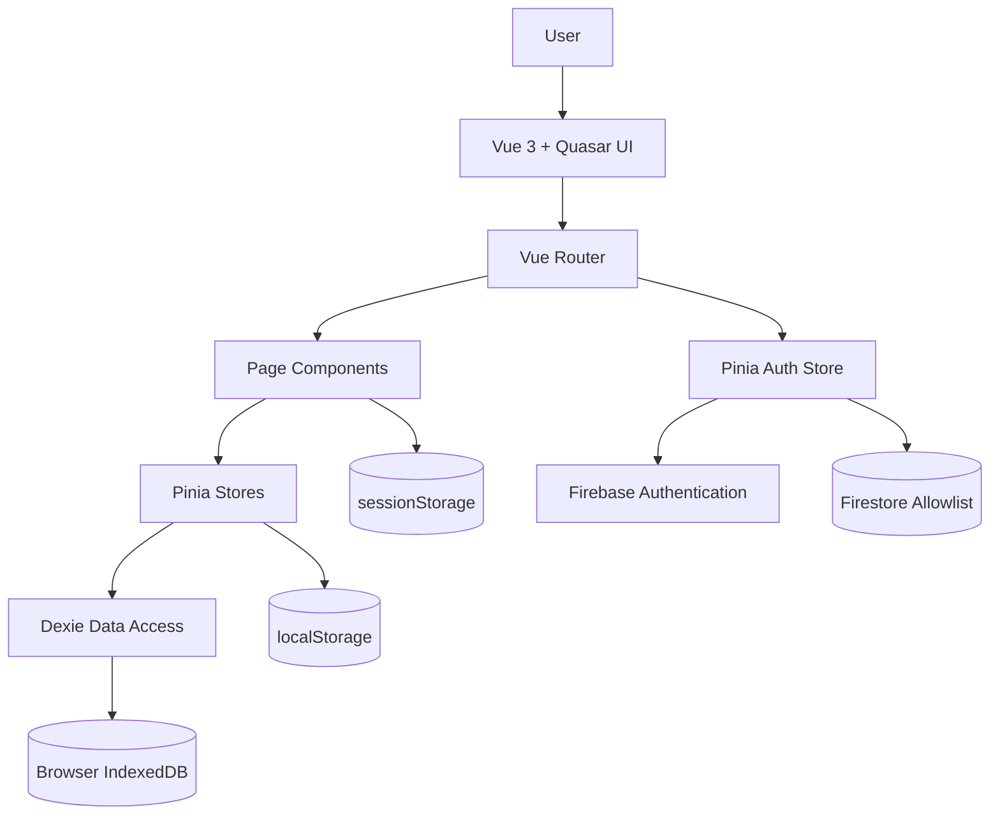
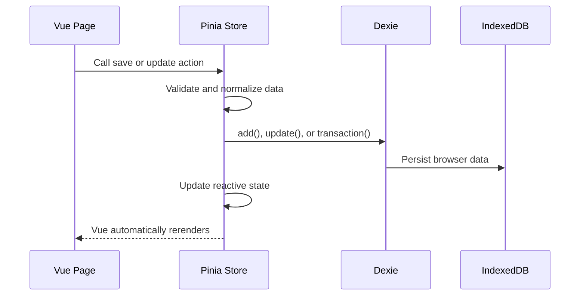
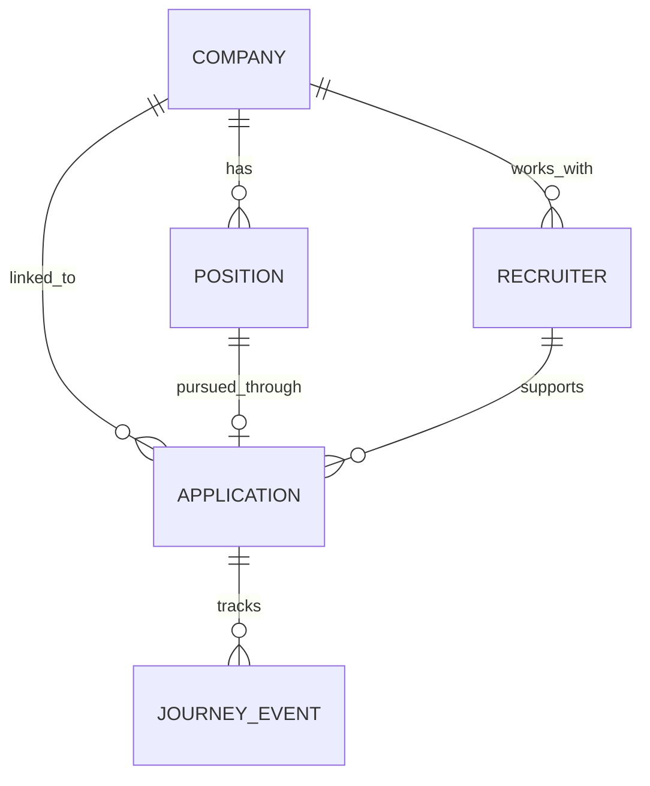

# Job Hunt Tracker Project Overview

## Executive Summary

**Job Hunt Tracker** is a client-side, local-first Progressive Web App for managing job applications, positions, companies, recruiters, and interview practice.

The application is built with:

- **Vue 3** for the component and reactivity model
- **TypeScript** for static typing
- **Quasar Framework** for UI components, layout, build tooling, and PWA packaging
- **Vue Router** for client-side navigation
- **Pinia** for application state and business logic
- **Dexie.js over IndexedDB** for durable local records
- **Firebase Authentication and Firestore** for login and access authorization only
- **Vite**, through Quasar CLI, for development and production builds

The defining architectural decision is that the app has **no conventional application backend**. Job-search data stays in the user's browser. Firebase controls who may enter the app, but it is not the primary database for tracker records.



## 1. Application Framework

The application uses **Vue 3.5** and follows the modern Composition API style. Components generally use `<script setup lang="ts">`, Vue refs, computed properties, and lifecycle hooks such as `onMounted`.

Examples include:

- The root component is intentionally minimal and renders the active route through `<router-view />`: [src/App.vue](../src/App.vue)
- The dashboard uses `ref`, `computed`, and `onMounted`: [src/pages/IndexPage.vue](../src/pages/IndexPage.vue)
- Pages consume shared Pinia stores through composables such as `useApplicationsStore()`: [src/pages/IndexPage.vue](../src/pages/IndexPage.vue)

This is a **Single-Page Application**, meaning navigation changes the rendered Vue component without requesting a new HTML page from the server.

## 2. Quasar's Role

Quasar is the application framework surrounding Vue. It provides:

- The responsive application shell
- Material-style components such as `QLayout`, `QDrawer`, `QCard`, `QDialog`, and `QForm`
- Icons and notifications
- Vite-based build tooling
- SPA and PWA build modes
- Boot-file initialization
- Responsive grid and utility CSS

The main shell is [src/layouts/MainLayout.vue](../src/layouts/MainLayout.vue), which contains:

- A top toolbar
- A responsive navigation drawer
- The nested `<router-view />`
- Settings and developer-tool dialogs
- Authentication controls
- Backup and import operations

Quasar plugins for dialogs and notifications are registered in [quasar.config.ts](../quasar.config.ts). The configuration also enables strict TypeScript checking and integrates `vue-tsc` and ESLint into development builds.

## 3. Routing Architecture

The routing library is **Vue Router**. Routes are created through Quasar's `defineRouter` wrapper in [src/router/index.ts](../src/router/index.ts).

The configured routes are:

| URL             | View                    |
| --------------- | ----------------------- |
| `/login`        | Login                   |
| `/`             | Dashboard and job board |
| `/applications` | Application journeys    |
| `/positions`    | Positions               |
| `/companies`    | Companies               |
| `/recruiters`   | Recruiters              |
| `/insights`     | Insights                |
| `/training`     | Interview training      |
| Any unknown URL | Not-found page          |

These mappings are defined in [src/router/routes.ts](../src/router/routes.ts).

### Nested Layout

Most authenticated pages are children of the `/` route and render inside `MainLayout`. This gives them a shared header, drawer, navigation, and settings UI.

The login route sits outside that layout because it is a standalone authentication screen.

### Lazy Loading

Every page and layout is loaded through a dynamic import:

```ts
component: () => import('@/pages/ApplicationsPage.vue');
```

This lets the build system split routes into separate JavaScript chunks, reducing the amount of code needed for the initial page load.

### History Mode

The app currently uses **hash routing**, configured in [quasar.config.ts](../quasar.config.ts). URLs therefore normally resemble:

```text
https://example.com/#/applications
```

Hash routing is especially straightforward for static hosting because the path after `#` is handled entirely by the browser.

### Authentication Guard

A global `beforeEach` navigation guard protects the application in [src/router/index.ts](../src/router/index.ts).

On every navigation, it:

1. Initializes the auth store.
2. Allows an authorized user to continue.
3. Redirects unauthorized users to `/login`.
4. Redirects an already-authorized user away from `/login`.

## 4. State Management With Pinia

**Pinia** is the centralized state-management library. Quasar creates the Pinia instance in [src/stores/index.ts](../src/stores/index.ts).

The major domain stores are:

- `useApplicationsStore`
- `useCompaniesStore`
- `usePositionsStore`
- `useRecruitersStore`
- `useInterviewPracticeStore`
- `useAuthStore`

Pinia is doing more than holding temporary UI state. Each store acts as a combination of:

- Reactive state container
- Business-logic service
- Persistence coordinator
- Data normalization layer
- Derived-data and query layer

For example, the applications store owns:

- Loaded application records
- The add/edit draft
- Search and archive filters
- User profile information
- Backup metadata
- CRUD operations
- Journey-status calculations
- Cross-record synchronization
- Backup and import behavior

Its state, getters, actions, and initialization logic are in [src/stores/applications.ts](../src/stores/applications.ts).

### Store Pattern

Most stores use Pinia's Options API:

```ts
defineStore('companies', {
  state: () => ({
    items: [],
    draft: createDraft(),
    editingId: null,
  }),

  getters: {
    activeItems: (state) => state.items.filter((item) => !item.archivedAt),
  },

  actions: {
    async init() {
      // Load durable records into reactive state.
    },
    async save() {
      // Persist a mutation and update reactive state.
    },
  },
});
```

A page obtains the store by calling its composable:

```ts
const companiesStore = useCompaniesStore();
```

When a component needs reactive references without losing Pinia reactivity, it uses `storeToRefs()`.

## 5. Local-First Persistence

The application's durable domain data is stored in the browser through **Dexie.js**, a typed wrapper around IndexedDB.

The database is declared in [src/db/database.ts](../src/db/database.ts). It is named:

```text
job-hunt-tracker-dev
```

Its IndexedDB tables include:

- `applications`
- `companies`
- `positions`
- `recruiters`
- `interviewQuestionCategories`
- `interviewQuestions`
- `interviewPracticeSessions`
- `interviewResponses`

This gives the app structured, queryable storage without requiring a remote server.

### Data Flow

A typical operation follows this path:



For example, saving an application:

1. Resolves its linked position, company, and recruiter.
2. Reconciles potentially conflicting relationships.
3. Normalizes the journey-event timeline.
4. Derives the current status from the latest event.
5. Writes the record to IndexedDB.
6. Updates the reactive in-memory collection.

That workflow is implemented in [src/stores/applications.ts](../src/stores/applications.ts).

## 6. Browser Storage Responsibilities

The app uses three browser-storage mechanisms for different purposes.

### IndexedDB

Used for durable, structured domain data:

- Applications
- Companies
- Positions
- Recruiters
- Interview questions and sessions

### localStorage

Used for small preference or metadata records:

- Profile name
- Last backup and import timestamps
- Cached authorization results for offline access

Profile and backup keys are managed in [src/stores/applications.ts](../src/stores/applications.ts). Authorization caching appears in [src/stores/auth.ts](../src/stores/auth.ts).

### sessionStorage

Used for short-lived navigation handoffs. For example, if someone starts an application, navigates away to create a missing company, and then returns, the draft can be restored.

That workflow is implemented in [src/composables/navigationHandoff.ts](../src/composables/navigationHandoff.ts).

## 7. Linked-Record Consistency

The main domain entities are connected by IDs:



Applications store both relationship IDs and some display snapshots, such as company, role, and recruiter name. This allows convenient rendering while the IDs preserve explicit relationships.

The applications store contains synchronization operations that update dependent applications when linked records change. Examples include:

- Reassigning company references
- Synchronizing company names
- Reassigning position references
- Synchronizing position titles
- Synchronizing recruiter names

These operations use Dexie transactions in [src/stores/applications.ts](../src/stores/applications.ts).

Records use `archivedAt` for **soft deletion**. Instead of immediately removing a record, the app timestamps it as archived. Store getters then expose active, archived, or all records depending on the current view.

## 8. Authentication and Firebase

Firebase has a narrow but important responsibility:

- **Firebase Authentication** signs users in.
- **Firestore** contains an `authorizedUsers` allowlist.
- Firestore may also indicate whether a user is an administrator.

Firebase is initialized through the Quasar boot file [src/boot/firebase.ts](../src/boot/firebase.ts), registered in [quasar.config.ts](../quasar.config.ts).

After login, the auth store checks for a Firestore document whose ID is the user's lowercased email. This behavior is defined in [src/stores/auth.ts](../src/stores/auth.ts).

Firebase therefore answers:

> May this person use the app?

It does **not** normally answer:

> What applications, companies, or interview records does this person have?

Those records remain in IndexedDB on the current browser and device.

## 9. Page and Component Organization

The source tree follows a domain-oriented Vue structure:

- `src/pages/` contains route-level screens.
- `src/layouts/` contains shared application shells.
- `src/components/` contains reusable UI components.
- `src/stores/` contains domain state and business operations.
- `src/db/` defines browser persistence.
- `src/types/` defines TypeScript domain models.
- `src/composables/` contains reusable navigation or behavior utilities.
- `src/data/` contains bundled interview-question packs.
- `src/boot/` initializes external services.
- `src/router/` defines navigation.
- `src-pwa/` contains PWA-specific configuration.

Pages initialize the stores they need during mounting. For example, the dashboard loads companies, positions, and applications before rendering linked names and pipeline data in [src/pages/IndexPage.vue](../src/pages/IndexPage.vue).

## 10. PWA and Deployment Model

The project can produce two Firebase Hosting builds:

- A standard SPA build in `dist/spa`
- An installable PWA build in `dist/pwa`

Both are configured in [firebase.json](../firebase.json).

The PWA build uses Workbox's `GenerateSW` mode, configured in [quasar.config.ts](../quasar.config.ts). Its manifest requests standalone display behavior and includes application icons in [src-pwa/manifest.json](../src-pwa/manifest.json).

The PWA architecture supports:

- Installation on compatible devices
- App-like standalone display
- Cached application assets
- Continued access to locally stored records

It is important to distinguish **local-first** from fully synchronized multi-device offline support. Because tracker data is stored in browser IndexedDB, data entered on one browser is not automatically available on another. JSON export and import provide manual portability and backup.

## 11. Development and Quality Tooling

The project uses:

- **TypeScript strict mode**
- **vue-tsc** for Vue-aware type checking
- **ESLint** for static analysis
- **Prettier** for formatting
- **Vitest** for automated tests
- **Playwright** for reliability smoke coverage
- **pnpm** as the repository's current package manager

The primary scripts are defined in [package.json](../package.json):

```text
pnpm dev
pnpm typecheck
pnpm lint:check
pnpm test
pnpm smoke:reliability
pnpm build
pnpm build:pwa
pnpm build:all
```

## Short Explanation to Reuse

> Job Hunt Tracker is a Vue 3 and TypeScript single-page application built with the Quasar framework. Vue Router handles navigation between the dashboard, applications, companies, positions, recruiters, insights, and training screens. Pinia provides centralized state and business logic, while Dexie stores the actual job-search records in IndexedDB in the user's browser. Firebase is used only for authentication and an access-control allowlist, not as the main tracker database. The app can be deployed as either a standard SPA or an installable PWA, and its local-first design allows core records to remain available without a traditional backend.

Project Overview
Executive Summary
Job Hunt Tracker is a client-side, local-first Progressive Web App for managing job applications, positions, companies, recruiters, and interview practice.

The application is built with:

- Vue 3 for the component and reactivity model
- TypeScript for static typing
- Quasar Framework for UI components, layout, build tooling, and PWA packaging
- Vue Router for client-side navigation
- Pinia for application state and business logic
- Dexie.js over IndexedDB for durable local records
- Firebase Authentication and Firestore for login and access authorization only
- Vite, through Quasar CLI, for development and production builds

The defining architectural decision is that the app has no conventional application backend. Job-search data stays in the user’s browser. Firebase controls who may enter the app, but it is not the primary database for tracker records.

1. Application Framework The application uses Vue 3.5 and follows the modern Composition API style. Components generally use <script setup lang="ts">, Vue refs, computed properties, and lifecycle hooks such as onMounted.

Examples include:

- The root component is intentionally minimal and renders the active route through <router-view />: App.vue:1-3
- The dashboard uses ref, computed, and onMounted: IndexPage.vue:151-160
- Pages consume shared Pinia stores through composables such as useApplicationsStore(): IndexPage.vue:155-163

This is a Single-Page Application, meaning navigation changes the rendered Vue component without requesting a new HTML page from the server.

2. Quasar’s Role Quasar is the application framework surrounding Vue. It provides:

- The responsive application shell
- Material-style components such as QLayout, QDrawer, QCard, QDialog, and QForm
- Icons and notifications
- Vite-based build tooling
- SPA and PWA build modes
- Boot-file initialization
- Responsive grid and utility CSS

The main shell is MainLayout.vue:1, which contains

- A top toolbar
- A responsive navigation drawer
- The nested <router-view />
- Settings and developer-tool dialogs
- Authentication controls
- Backup/import operations

Quasar plugins for dialogs and notifications are registered in quasar.config.ts:80-101. The configuration also enables strict TypeScript checking and integrates vue-tsc and ESLint into development builds: quasar.config.ts:39-66.

3. Routing Architecture
   The routing library is Vue Router. Routes are created through Quasar’s defineRouter wrapper in index.ts:1-32.

The configured routes are:
URL --> View
/login --> Login
/ --> Dashboard/job board
applications --> Application journeys
/positions --> Positions
/companies --> Companies
/recruiters --> Recruiters
/insights --> Insights
/training --> Interview training
Any unknown URL --> Not-found page

These mappings are defined in routes.ts:3-28.

Nested Layout
Most authenticated pages are children of the / route and render inside MainLayout. This gives them a shared header, drawer, navigation, and settings UI. The login route sits outside that layout because it is a standalone authentication screen.

Lazy Loading
Every page and layout is loaded through a dynamic import: `component: () => import('@/pages/ApplicationsPage.vue')`. This lets the build system split routes into separate JavaScript chunks, reducing the amount of code needed for the initial page load.

History Mode
The app currently uses hash routing, configured in quasar.config.ts:45-48. URLs therefore normally resemble: `https://example.com/#/applications`

Hash routing is especially straightforward for static hosting because the path after `#` is handled entirely by the browser.

Authentication Guard
A global beforeEach navigation guard protects the application: index.ts:34-47.

On every navigation, it:

1. Initializes the auth store.
2. Allows an authorized user to continue.
   3.Redirects unauthorized users to /login.
3. Redirects an already-authorized user away from /login.

4. State Management With Pinia
   Pinia is the centralized state-management library. Quasar creates the Pinia instance in index.ts:1-28.

The major domain stores are:

- useApplicationsStore
- useCompaniesStore
- usePositionsStore
- useRecruitersStore
- useInterviewPracticeStore
- useAuthStore

Pinia is doing more than holding temporary UI state. Each store acts as a combination of:

- Reactive state container
- Business-logic service
- Persistence coordinator
- Data normalization layer
- Derived-data/query layer

For example, the applications store owns:

- Loaded application records
- The add/edit draft
- Search and archive filters
- User profile information
- Backup metadata
- CRUD operations
- Journey-status calculations
- Cross-record synchronization
- Backup/import behavior

Its state and getters begin in applications.ts:372-449, while initialization loads durable records from IndexedDB: applications.ts:452-494.

Store Pattern Most stores use Pinia’s Options API:
`defineStore('companies', {
state: () => ({
items: [],
draft: createDraft(),
editingId: null,
}),

getters: {
activeItems: (state) => ...
},

actions: {
async init() { ... },
async save() { ... },
},
});`

A page obtains the store by calling its composable:
`const companiesStore = useCompaniesStore();`

When a component needs reactive references without losing Pinia reactivity, it uses `storeToRefs()`.

5. Local-First Persistence
   The application’s durable domain data is stored in the browser through Dexie.js, a typed wrapper around IndexedDB.

The database is declared in database.ts:10-35. It is named:
`job-hunt-tracker-dev`

Its IndexedDB tables include:

- applications
- companies
- positions
- recruiters
- interviewQuestionCategories
- interviewQuestions
- interviewPracticeSessions
- interviewResponses

This gives the app structured, queryable storage without requiring a remote server.

Data Flow
A typical operation follows this path:

For example, saving an application: Resolves its linked position, company, and recruiter. Reconciles potentially conflicting relationships. Normalizes the journey event timeline. Derives the current status from the latest event. Writes the record to IndexedDB. Updates the reactive in-memory collection. That workflow appears in applications.ts:556-637. 6. Browser Storage Responsibilities The app uses three browser-storage mechanisms for different purposes: IndexedDB Used for durable, structured domain data: Applications Companies Positions Recruiters Interview questions and sessions localStorage Used for small preference or metadata records: Profile name Last backup/import timestamps Cached authorization results for offline access Profile and backup keys are managed in applications.ts:77-129. Authorization caching appears in auth.ts:27-41. sessionStorage Used for short-lived navigation handoffs. For example, if someone starts an application, navigates away to create a missing company, and then returns, the draft can be restored. That workflow is implemented in navigationHandoff.ts:13-68. 7. Linked-Record Consistency The main domain entities are connected by IDs: Applications store both relationship IDs and some display snapshots, such as company, role, and recruiter name. This allows convenient rendering while the IDs preserve explicit relationships. The store contains synchronization operations that update dependent applications when linked records change. Examples include: Reassigning company references Synchronizing company names Reassigning position references Synchronizing position titles Synchronizing recruiter names These operations use Dexie transactions in applications.ts:843-1079. Records use archivedAt for soft deletion. Instead of immediately removing a record, the app timestamps it as archived. Store getters then expose active, archived, or all records depending on the current view.

8. Authentication and Firebase
   Firebase has a narrow but important responsibility:

Firebase Authentication signs users in.
Firestore contains an authorizedUsers allowlist.
Firestore may also indicate whether a user is an administrator.
Firebase is initialized through the Quasar boot file firebase.ts:1-25, registered in quasar.config.ts:10-13.

After login, the auth store checks for a Firestore document whose ID is the user’s lowercased email: auth.ts:19-41.

This means Firebase answers:

“May this person use the app?”

It does not normally answer:

“What applications, companies, or interview records does this person have?”

Those records remain in IndexedDB on the current browser/device.

9. Page and Component Organization
   The source tree follows a domain-oriented Vue structure:

pages contains route-level screens.
layouts contains shared application shells.
components contains reusable UI components.
stores contains domain state and business operations.
db defines browser persistence.
types defines TypeScript domain models.
composables contains reusable navigation or behavior utilities.
data contains bundled interview-question packs.
boot initializes external services.
router defines navigation.
src-pwa contains PWA-specific configuration.
The pages initialize the stores they need during mounting. For example, the dashboard loads companies, positions, and applications before rendering linked names and pipeline data: IndexPage.vue:274-278.

10. PWA and Deployment Model
    The project can produce two Firebase Hosting builds:

A standard SPA build in spa
An installable PWA build in pwa
Both are configured in firebase.json:6-29.

The PWA build uses Workbox’s GenerateSW mode, configured in quasar.config.ts:153-163. Its manifest requests standalone display behavior and includes application icons: manifest.json:1-37.

The PWA architecture supports:

Installation on compatible devices
App-like standalone display
Cached application assets
Continued access to locally stored records
It is important to distinguish local-first from fully synchronized multi-device offline support: because tracker data is stored in browser IndexedDB, data entered on one browser is not automatically available on another. JSON export/import provides manual portability and backup.

11. Development and Quality Tooling
    The project uses:

TypeScript strict mode
vue-tsc for Vue-aware type checking
ESLint for static analysis
Prettier for formatting
Vitest for automated tests
Playwright for reliability smoke coverage
pnpm as the repository’s current package manager
The primary scripts are defined in package.json:8-20:

Short Explanation to Reuse
Job Hunt Tracker is a Vue 3 and TypeScript single-page application built with the Quasar framework. Vue Router handles navigation between the dashboard, applications, companies, positions, recruiters, insights, and training screens. Pinia provides centralized state and business logic, while Dexie stores the actual job-search records in IndexedDB in the user’s browser. Firebase is used only for authentication and an access-control allowlist, not as the main tracker database. The app can be deployed as either a standard SPA or an istallable PWA, and its local-first design allows core records to remain available without a traditional backend.
